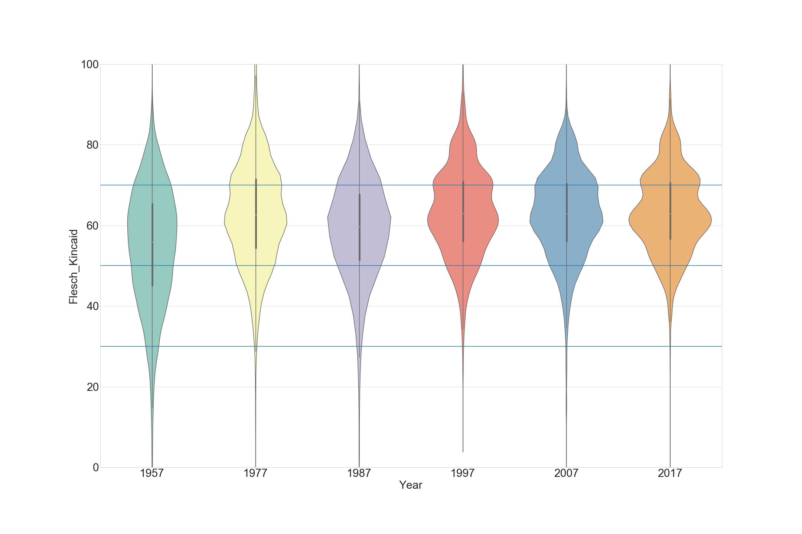
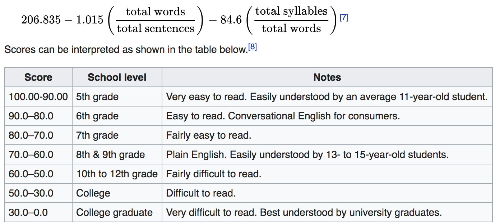
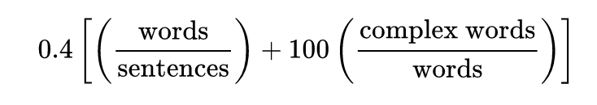
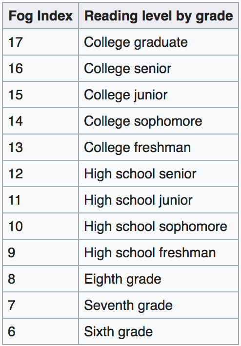
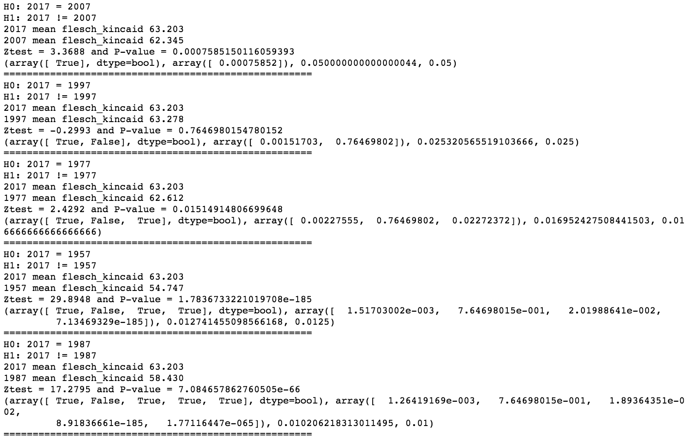

# Is The New York Times Writing for a Dumber America?
#### A Inside look at the complexity of articles over time 
Taking an in depth look at the composition of New York Times articles over the course of its existence to evaluate competency among audience and potential insights into the NYT's writing strategy. 

# Motivation 
In our day and age how are we receiving daily information from the New York Times that is
reflective of our educational progress as a society?

This project aims to decipher complexities in articles that are released by its organization.
The reason the New York Times is such a good sources is due to its longevity, presence 
and reputation as a news outlet. Millions of readers across the United States indulge 
in the New York Times every year. This audience are reading articles from a variety of 
sections. So how do these articles 'grade level' complexity compare across time. 

Readability: Readability formulas measure the grade-level readers must have to read a given text

# Process 

### Collecting the Data 
1) Submit an API-KEY request to the New York Times. Initial rate limit is set to 
1000 calls per day or 1 per second. You may submit a request for more (code@newyorttimes.com)
if you are not using it for commercial or monetary purposes. 

2) Utilize a script that will be able to execute a few main functions. 

- Make a call request from the API 
- Identify the URL, request the web url, scrape the web page for the body of the article 
- Store into MongoDB 

### Cleaning the data 
Luckily most of this data comes in fairly clean. While you must be aware some faults 
with how the requests come through for different years. Two issues I came across were that
certain years web pages use a different HTML tag to mark the body. If this is not caught you will then not be able to properly scrape the body of the article. A second issues I came across
was that some of the older years articles were not digitized by the New York Times. This results in the body of text returning "This article has not been digitized...". If you do not 
Identify these articles it will end up skewing the mean grade scoring. Also due to inconsistencies with how the API pulls we will end up with different amounts of articles per year. 

#### Mean Flesch_Kincaid Score Distributions
 

- Contains news sections ranging from obituaries, OpEd, business, world, U.S., economy, sports and many more 
 

### Flesch-Kincaid & Gunning-Fog
#### Flesch-Kincaid 
Def: The Flesch-Kincaid was a comprehension and readability metric that was designed by 
J. Peter Kincaid and team for the Navy in 1975. This formula was initially utilized by the Army to assess the difficulty of technical manuals.This metric is widely used as a grade level assessment for various types of reading materials (often used by teachers). The Flesch-Kincaid formula is as follows. 

########################
--- Add in examples sentences of each grade level -- courtesy of wikipedia

    The cat sat on the mat = 116
    This sentence, taken as a reading passage unto itself is being use to prove a point = 74.1
    The Australian platypus is seemingly a hybrid of a mammal and reptilian creature. = 37.5

##########################

#### Gunning-Fog Index 
Def: The Gunning-Fog is a readability metric that was designed by Robert Gunning in 1952. This is 
also a well known comprehension metric. This metric is slightly different from the Flesch-Kincaid in that it takes into account 'complex words' which are defined as words with three or more syllables. 

##### Formula 

##### Index

A limitation of the Gunning-Fog is that not all 'complex' words are difficult. For example, competition, responsibility etc.

### Hypothesis Testing 
The main approach to determine if there is significant differences between the mean 
Flesch-Kincaid between years. In order to focus in on this it was 
decided to strictly work with a two tailed hypothesis test where. A few variables that are 
set is that we will be assuming an *alpha* of .05, also we will be assuming unequal variance 
to allow for differences in variance between years. This will be an independent test of means 
due to the fact this is a mutually exclusive and completely exhaustive approach as we are segmenting 
by years with a difference in years equivalent to a decade. 

- H0: 2017 = (2007,1997,1987,1977,1967,1957)
- H1: 2017 != (2007,1997,1987,1977,1967,1957)

The results are quite fascinating. As you saw in the visual above it does seem as though the mean assessment score between years is quite similar. When we get down into the hypothesis which operates 
by taking the mean difference between years by the standard deviation between samples.

# Benjamini-Hochburg: P-Value Correction
Purpose: When you perform a large number of statistical tests, some will have P values less than 0.05 purely by chance, even if all your null hypotheses are really true. The Bonferroni correction is one simple way to take this into account; adjusting the false discovery rate using the Benjamini-Hochberg procedure is a more powerful method.(http://www.biostathandbook.com/multiplecomparisons.html)

The goal of multiple comparisons corrections is to reduce the number of false positives.

*Some potential issues with this type of assessment. If there were authors that have been writing 
for the New York Times across several decades this could influence the results as the years would then 
have a dependent and indicative parameter (would most likely occur for 2017,2007 tests). Due to the number of articles drawn we are assuming the likelihood of this occurring and having a significant effect to the test.*

# Future Inspection
### Latent Dirichlet Analysis (LDA)

Latent Dirichlet Analysis, also known as LDA is a method of natural language processing that operates by finding hidden *latent* features in the text to identify trends in topics between text. This is the operation that was used to determine the differences in trends between years. This process is performed by through a few steps. 

-  1) Cleaning the text of all non-indicative words such as (the, you, me, as, a, etc.)
-  2) Running a CountVectorizer on all of the text in the corpus 
-  3) Creating a feature matrix that identifies the commonality of each word to a 'topic'
-  4) Running an analysis on this matrix that discovers unique themes to each set of text that
  is associated with your topic 

### Topic Modeling & Prediction 

Through the inspection of my database of articles I found that only in recent years the New York Times has been thoroughly documenting material. Defining what kind of articles it was, their sources, their topics, news desks and much more. This is very helpful and allows for a whole new realm of possibilities for data science and discoveries. 

What makes the New York Times special is their longevity in the news industry. Although each year moving back towards their date of creation comes at a loss of filled out information coming from their API. Some next steps to making this database more robust is to predict what the possible news desk and section would be for a specific body of text. 

Initial Findings:
- Utilizing a Multinomial Naive Bayes classifier 
    - Prediction section_name
    - Test Train Split (70,30)
    - TfidfVectorizer
    - Prediction Score (Accuracy) - 38%
  
- These were performed on an a dataset that exclusively held 2017 articles 

This was done as very early stage look at its potential. A lot of investigating still needs to be done as to whether current articles could be used as a method to predict older articles. Or the alternative would be to use topic modeling and unsupervised learning to create the topics and align them with modern day section_name labeling. 

### Googly NYT 
Creation of a web app through Flask that will allow to search through different eras, news sections, news desks or 
authors. 

# Tools 
- [BeautifulSoup](https://www.crummy.com/software/BeautifulSoup/bs4/doc/): Web scraping library for Python
- [Mongodb](https://www.mongodb.com/): A NoSQL Database 
- [New York Times API](https://developer.nytimes.com/): The New York Times Search API
- [Scipy-Stats](https://docs.scipy.org/doc/scipy/reference/stats.html): A statistical library for Python 
- [Stats Models](https://statsmodels.org): Library for conducting statistical tests, and statistical data exploration. 
- [Pandas](https://pandas.pydata.org/): A library for manipulation and analysis 
- [Numpy](http://www.numpy.org/): Library for matrices handling 
- [Amazon Web services](https://aws.amazon.com/): An on demand cloud computing platform
- [Pymongo](https://api.mongodb.com/python/current/): A Python library to communicate with Mongodb
- [Sklearn](http://scikit-learn.org/stable/): Machine learning library
- [Itertools](https://docs.python.org/2/library/itertools.html): Library for efficient looping
- [Datetime](https://docs.python.org/2/library/datetime.html): A date and time library
- [Json](https://docs.python.org/2/library/json.html): Library for handling json objects
- [Pickle](https://docs.python.org/3/library/pickle.html): File Compression 
- [Textstat](https://pypi.python.org/pypi/textstat): Library for analysis of text
- [Seaborn](http://seaborn.pydata.org/): Data visualization 
- [Matplotlib](https://matplotlib.org/): Data visualization 

