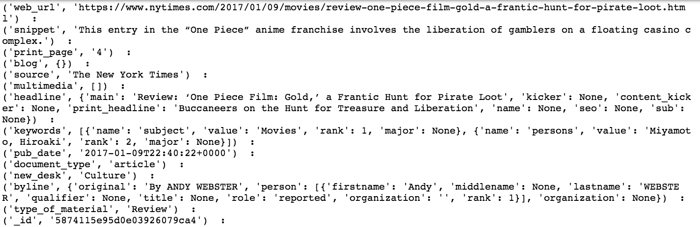

# NYT GIST

## Sections 
- 1) NYT API (Applicational Programming Interface)
- 2) Web Scraping 

# [New York Times API](https://developer.nytimes.com/) 

##### Request API KEY
- https://developer.nytimes.com/signup

##### NYT Search API 

- The [ReadMe](https://developer.nytimes.com/article_search_v2.json#/README) contains valuable information about the types of fields that are returned from the API and insight into the types of query's that you can make on the database 
- The New York Times database takes advantage of [Lucene](https://lucene.apache.org/core/) which is a " high-performance, full-featured text search engine library written entirely in Java."

##### Option 1
> import requests 

> Import json

    #The link references the API end point
    link = 'http://api.nytimes.com/svc/search/v2/articlesearch.json'
    
    # The payload specifies your unique api_key and what page you would like 
    # Every query returns a response of 10 'articles' 
    
    payload = {'api-key': 'YOUR_API_KEY_HERE','page':0}

    def single_query(link, payload):  
          response = requests.get(link, params=payload)
          if response.status_code != 200:
              print ('WARNING', response.status_code)
          else:
              return response.json()
          
    
    q = single_query(link, payload)

#### Option 2
[nytimesarticle](https://pypi.python.org/pypi/nytimesarticle/0.1.0) documetation 
> from nytimesarticle import articleAPI

  api = articleAPI('YOUR_API_KEY_HERE')
  
  articles = api.search(begin_date = 20170109,end_date=20170110, page=1, source = 'The New York Times',\
                      facet_field='type_of_material',facet_filter=True)
                      
                      
  payload = {'api-key': 'YOUR_API_KEY_HERE','fq':'print_page:1 The New York Times AND document_type:("article")','fl':'section_name,document_type,word_count,type_of_material,keywords,print_page'}
  

  html_str2 = single_query(link, payload)
  
  Adding in fq & fl to your payload will utilize Lucene methods in order to make more 
  specific queries. From my experience this sometimes worked and sometimes did not

#### NOTE 

For both methods mentioned above the response comes back in a series of nested dictionaries 

Three Main Fields 
- Response 
- Meta 
- Copyright 

In order to access the documents you must use dictionary notation 

articles['response']['docs'] - will give you access to the 10 articles that were pulled from the API 

To view the properties of an article you may use something like this 

    for article in articles:
      for item in article.items():
          print (item,' : ')
    print('----------------------------------------')
    

# Web Scraping with Beautiful Soup

Purpose: After pulling in the API requests from the New York times Articles Search API we must get the text from the article. The API request only provides you with a url in which to see the article.

> from bs4 import BeautifulSoup 

> import requests

###### URL of Web
> url =[nyt_example_url](https://www.nytimes.com/2018/01/22/us/politics/schumer-democrats-shutdown.html?hp&action=click&pgtype=Homepage&clickSource=story-heading&module=first-column-region&region=top-news&WT.nav=top-news&mtrref=www.nytimes.com)

Utilizing the code from above you could loop through the documents web urls to make a collection of text 

    for doc in articles['response']['docs']:
      url = doc['web_url']
      etc...etc...

###### This submits a 'request' so that the code will navigate to the page when scraping
> r = requests.get(url)

###### By checking the status code of the get request you will be able to gain insights if there was a successful
###### request or if there was an error
> if r.status_code != 200:
    print("unsuccessful")

###### Capture the html 'soup' from the requested page
> soup = BeautifulSoup(r.text.encode('utf-8'))

###### Tell Beautiful Soup to find all the text that is located in a 

 (paragraph field) and identify the class 
that you want scrape text from, in this particular instance the body paragraph text is denoted by the class 
"story-body-text story-content" -- you you get the soup will be different for every website. * The field types and locations will vary with websites
> body = soup.find_all('p', class_= "story-body-text story-content")
  
  
###### Join all the soup together so that is one text field
> document = '\n'.join([x.get_text() for x in body])   

